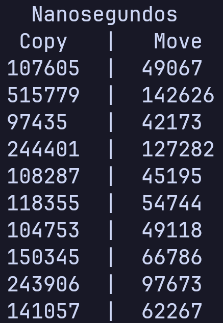
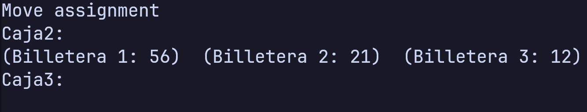

# Analisis Move Semantics

Jose Javier Alva Cornejo

Arthur Patrick Meza Pareja

## 106.2 Reducir complejidad

Al reducirse la cantidad de copias, solo se realizan aquellas relacionadas a los pushback del vector




## 106.3 Move Constructor

Nos "robamos" los campos del otro objeto y le asignamos valores para que se puede seguir usando

```cpp
  // Constructor move
  Caja(Caja &&otra) noexcept {
    n = otra.n;
    billeteras = otra.billeteras;
    otra.n = 0;
    otra.billeteras = new Billetera[0];
  }

  ...

  // Move constructor
  std::cout << "Move constructor" << std::endl;
  Caja caja4(std::move(caja1));

  std::cout << "Caja1: \n"
            << caja1 << std::endl;
  std::cout << "Caja Movida: \n"
            << caja4 << std::endl;
```


## 106.4 Re-use a moved object

Se puede asignar nuevos valores a un objeto indeterminado sin que se de una excepción.

```cpp
  // Re-use moved
  std::cout << "\n\nReusar moved" << std::endl;
  caja1.asignar({10, 10, 10});
  std::cout << "Caja1: \n"
            << caja1 << std::endl;
```


## 106.5: Move assignment

Se asigna a caja 2 los valores de la 3, esta la dejamos en un estado en el que se puede seguir realizando operaciones.

```cpp
  // Move assignment
  std::cout << "\n\nMove assignment" << std::endl;

  caja2 = std::move(caja3);
  std::cout << "Caja2: \n"
            << caja2 << std::endl;

  std::cout << "Caja3: \n"
            << caja3 << std::endl;
```



## 106.6: Using move semantics on containers
Los contenedores STL aplican todos los principios que se implementaron en nuestra clase Caja


